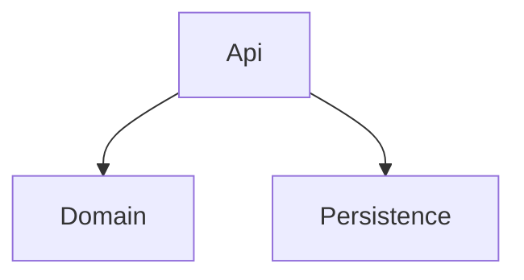
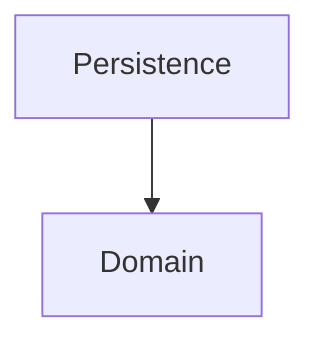
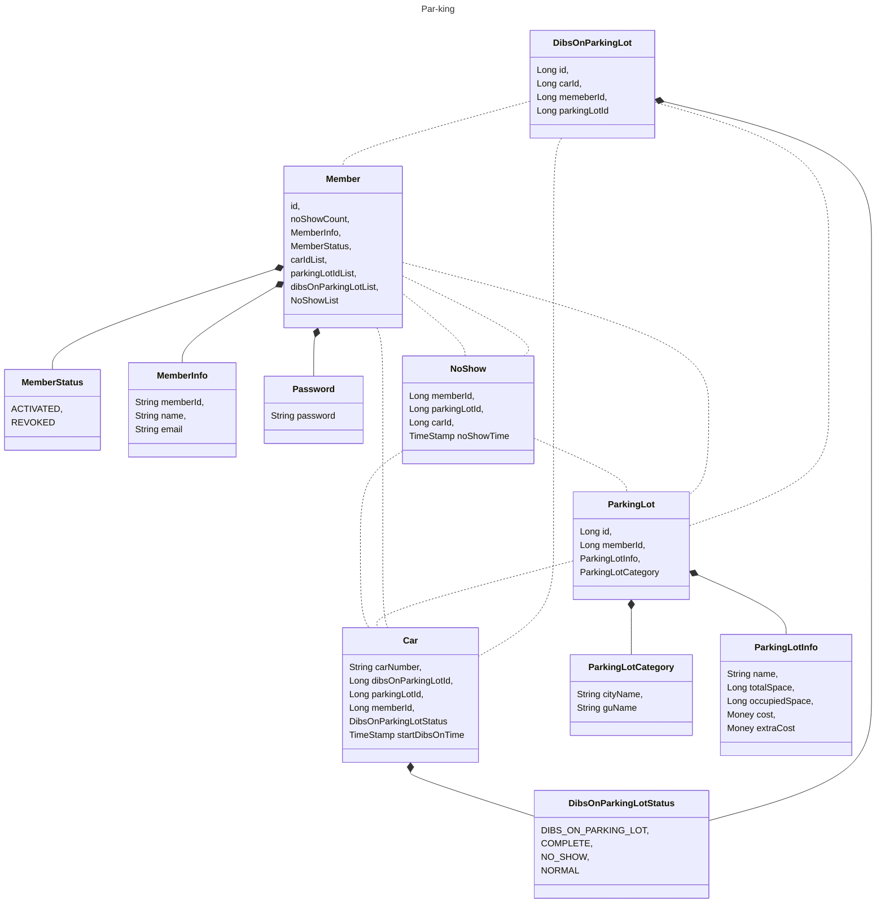
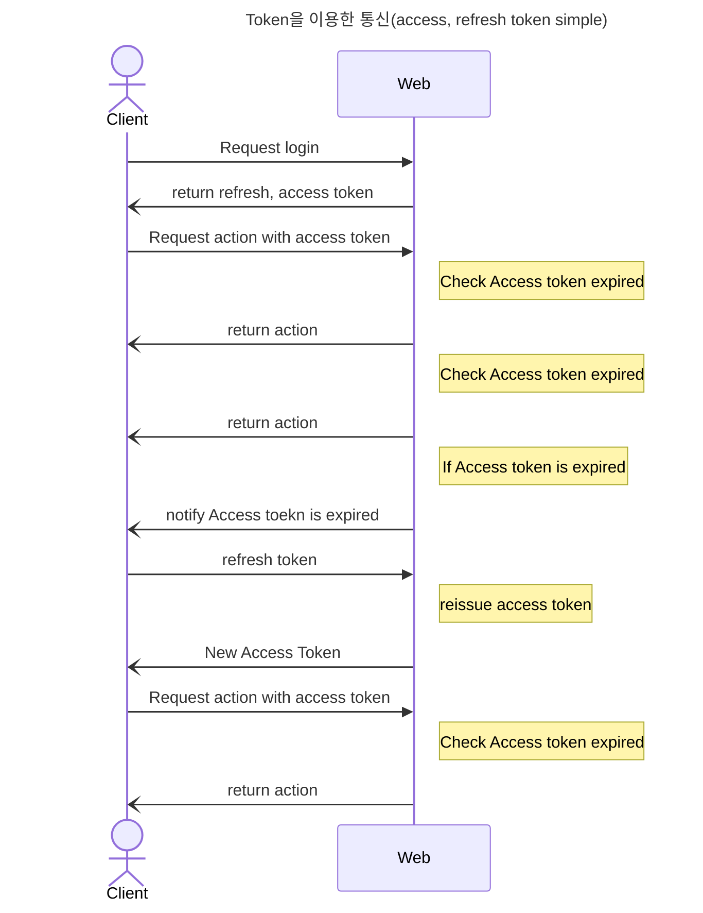

# Par-king

Par-King (주차장 관리 프로그램)
- parking 에서 king을 가져와 주차장 관리하는 프로그램중에 King을 목표로 해본다?는 의미입니다.

무엇을 하는 프로그램인가?

- 여러 주차장에 대해서 이용 가능한 자리를 빠르게 확인하고 찜기능을 통해서 자리를 맡아두는 기능. 악성 유저를 방지하기 위해 찜은 timeout 적용

주요 기능 목차

    1. Login

    2. 데이터베이스

    3. Redis

    4. Kafka

    5. 찜기능

<h3>Login</h3>

How?

Spring Security 적용하여 회원 로그인을 관리한다.
JWT를 이용하여 세션을 관리한다 (detail 필요)
된다면, 권한을 분리하는것도 적용해보면 좋을지도... UI 분리가 필요할 수도 있으니 쉽지 않아보임

<h3>DataBase</h3>

What?

크게 회원, 주차장 테이블로 구성
RDB or NoSQL 어떤것으로 할지 고민 필요. read, write 의 빈도와 비중을 고려하여 판단하면 될듯

<h3>Redis</h3>

When?

크게 3 부분에서 사용할 것으로 추정된다. JWT token & 주차장 실시간 상태 & Distributed Lock

주차장 상태가 +, - 가 굉장히 빠른 상태로 변할것으로 생각됨. 이 부분에 대해서 redis를 이용하면 적합해보인다.
고려할 점은 중복 요청이 발생하지 않게 하기 위한 고민이 필요해보임
또한, 1자리가 남은 경우 동시에 2명의 사용자가 찜을 하는 상황을 막기 위해 distributed Lock을 사용해야하는데 이 부분을 개발시 필요할 것으로 보임

<h3>Kafka</h3>

When?

찜을 한 주차장에 대해서 노쇼고객이 발생할것을 우려하여 찜에 대한 timeout을 적용이 필요해보인다.
찜을 한 상태에서 입차를 제한 시간안에 안한 경우 찜을 자동 취소하는 기능.
타임아웃 된 경우 사용자에게 안내를 위해서 써볼 수 있지 않을까 생각중.

<h3>찜 기능</h3>

What?

사용자가 주차할 주차장에 자리가 있는 경우 찜을 할 수 있으며, 찜을 한 경우 제한시간(아직 불확실) 이내에 입차를 하지 않을 경우 timeout 으로
찜이 자동 취소되는 기능

<h2>Module</h2>

<h3>Api</h3>
역할 : Controller, useCase, Service, Port 등 외부의 응답이 들어오거나 나가는 역할을 한다

<h3>Domain</h3>
역할 : Domain을 정의하고 domain에 business logic을 관리한다

<h3>Persitence</h3>
역할 : DB, Redis 등 SQL과 관련된 정보를 설정 및 관리한다.

<h3>Module 관계도</h3>

<h2>Entity 관계도</h2>

<h2>JWT</h2>

